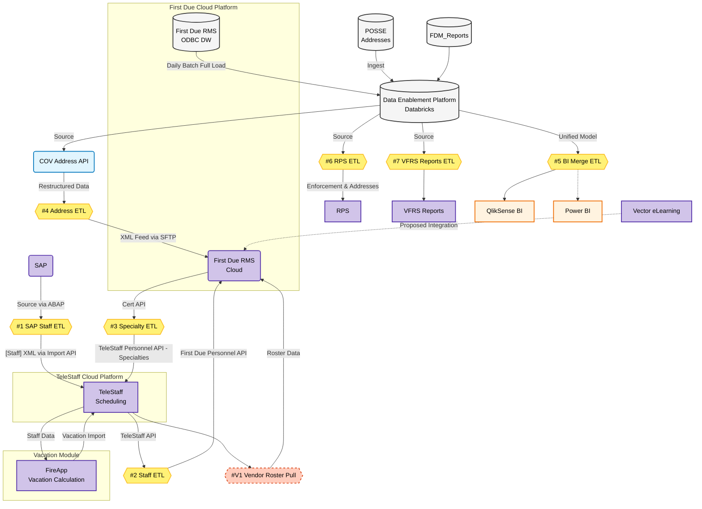
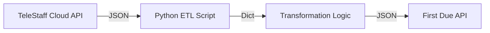

# VFRS Technical Specification

**Date:** February 6, 2026
**Version:** 1.1
**Status:** Living Document
**Target Systems:** First Due RMS, TeleStaff, Databricks, SAP, POSSE/Tempest

## 1. Executive Summary
This document serves as the master technical specification for the VFRS System Integration & Data Migration project. It synthesizes the future state system design, detailed ETL specifications, and data transformation plans into a single source of truth.

The primary goals are:
1.  **Cloud Migration:** Transitioning from on-premise TeleStaff to TeleStaff Cloud.
2.  **RMS Modernization:** Implementing First Due as the new Records Management System.
3.  **Data Enablement:** Establishing Databricks as the central data hub for integration and analytics.

---

## 2. System Architecture

This diagram represents the future state architecture for the VFRS RMS replacement, incorporating Databricks as the central Data Enablement Platform and First Due as the cloud RMS.



---

## 3. Integration & ETL Specifications

This section outlines the ETL (Extract, Transform, Load) processes defined in the VFRS Future State System Design.

### #1 SAP Staff ETL

<div class="status-banner status-warning">STATUS: PENDING</div>

**Process Description**  
This process handles the synchronization of staff/personnel data from the corporate SAP system into the TeleStaff scheduling system.

*   **Source**: SAP (accessed via ABAP program).
*   **Target**: TeleStaff Cloud Platform (Import API).
*   **Data Type**: Staff Personnel Data (Profiles, IDs, Demographics).
*   **Legacy Reference**: `VFRS integration.xlsx` (VanDocs Record ID: `DOC/2024/036789`), **Line 4** (Integration: SAP HR data to TeleStaff).

#### Current Status & Background (As of 2026-01-20)
*   **Project Context**: This ETL modification is required for the migration of TeleStaff to the Cloud environment.
*   **Status**: Pending. Development cannot commence until the TeleStaff Cloud Development instance is provisioned and available.

| Field | Value (Current/Legacy) | Future State |
| :--- | :--- | :--- |
| **Integration Name** | SAP HR data to TeleStaff | SAP to TeleStaff Cloud |
| **Source System** | SAP HR | SAP HR |
| **Source Method** | ABAP Program (`ZHR_TELESTAFF_DELTA`) | ABAP Program (`ZHR_TELESTAFF_DELTA`) |
| **Target System** | TeleStaff (On-Prem) | TeleStaff Cloud Platform |
| **Target Method** | Network Share (`\\telstfapp01\import`) | **TeleStaff Import API** |
| **Format** | XML (`PersonImport.xsd`, `Staffing01.xsd`) | XML (Same Schema) |
| **Frequency** | Daily (Weekdays) @ 04:30:00 | Daily (Weekdays) @ 04:30:00 |
| **Description** | Extracts SAP HR personal and quota data changes. Transforms to XML. | Extracts same data. Pushes to Cloud API instead of file share. |
| **Owner** | Shine Jose | Shine Jose (TBC) |

#### Change Overview
*   **Legacy Method**: The ABAP program `ZHR_TELESTAFF_DELTA` extracted data and saved XML files to a network share monitored by the on-premise TeleStaff Import Manager.
*   **New Method**: The same ABAP program logic will be used to extract the data. However, instead of writing to a network share, the integration must be updated to POST the XML data to the **TeleStaff Import API** endpoint.
    
#### Technical Notes
*   The logic for data mapping remains largely consistent with the legacy integration.
*   Security mechanisms (Authentication/Authorization) for the TeleStaff Cloud API need to be configured in the SAP outbound process.

### #2 Staff ETL

<div class="status-banner status-high-risk">STATUS: BLOCKED / IN ANALYSIS</div>

**Process Description**  
This ETL process synchronizes staff/personnel data from the **TeleStaff Cloud Platform** (Source) to the **First Due RMS** (Target). It replaces legacy file-based transfers with a direct API-to-API integration to create and update personnel records in First Due to match the active roster in TeleStaff.

#### Current Status & Background (As of 2026-02-03)
*   **Status**: Blocked / In Analysis (Proceeding with Assumptions).
*   **API Stability**: The First Due Personnel API is currently unstable/buggy. Active troubleshooting is in progress with Kieran (First Due vendor contact).
*   **Architecture Decision**: Proceeding with **Direct Cloud-to-Cloud** integration design (TeleStaff -> First Due) based on the assumption that this domain-specific data does not need to flow through Databricks.
*   **Requirements**: The technical specification below is based on the logic defined in `ETL_02_Plan.md`, pending final business confirmation on "Create New" vs. "Update Existing" rules.

| Field | Detail |
| :--- | :--- |
| **Integration Name** | TeleStaff to First Due (Personnel) |
| **Source System** | TeleStaff Cloud Platform |
| **Source Method** | API (`/api/v1/wfts/person/multi_read`) |
| **Target System** | First Due RMS |
| **Target Method** | First Due Personnel API (`/fd-api/v1/personnel`) |
| **Format** | JSON |
| **Frequency** | External Scheduler (Frequency TBD) |
| **Matching Logic** | `TeleStaff.employeeId` (zero-padded) matches `FirstDue.agency_id` |

#### Detailed Implementation Design

**Overview**
- **Integration Goal**: Create and update personnel records in First Due to match the active roster in TeleStaff.
- **Trigger**: External Scheduler (Frequency TBD).
- **Owner**: TBD.

**Architecture & Data Flow**



**Components**
1.  **Extraction Module**: Connects to TeleStaff `api/v1/wfts/person/multi_read` to pull all active personnel.
2.  **Transformation Module**: Maps TeleStaff fields (Rank, Name, ID, etc.) to First Due schema. Handles value conversions (e.g., Dates, Booleans).
3.  **Loading Module**:
    - Queries First Due for existing personnel (to get `id` or `uuid`).
    - **Matching Logic**: 
        - Primary Key: `FirstDue.agency_id` (padded)
        - Logic: Match against Source ID: `TeleStaff.employeeId.zfill(6)`
        - Example: Source `6841` -> Matches Target `agency_id` `"006841"`.
    - **Creation Rules**:
        - **Filter**: Only create if `email` ends with `@vancouver.ca` (case-insensitive).
    - **Upsert Logic**:
        - If exists: `PATCH /fd-api/v1/personnel/{id}`
        - If new: `POST /fd-api/v1/personnel`

**Implementation Steps**

**Step 1: Configuration**
- **File**: `etl/02_Staff_ETL/staff_etl_config.ini` (Local standalone config).
- **Template**: `etl/02_Staff_ETL/staff_etl_config.template.ini` (Committed).
- Update `credentials.ini` only if shared credentials are preferred, otherwise keep strict separation in the local ini.

**Step 2: Extraction (TeleStaff)**
- **Endpoint**: `/api/v1/wfts/person/multi_read`
- **Method**: POST (with empty filter for all) or GET.
- **Output**: List of Person dictionaries.

<details>
<summary><strong>Step 3: Transformation Strategy (Field Mappings)</strong></summary>

#### Field Mappings (Full Schema)

| Target Field | Type | Required? | Source (TeleStaff) / Value | Transformation / Notes |
| :--- | :--- | :--- | :--- | :--- |
| `first_name` | string | **Yes** | `first_name` | Direct map. |
| `last_name` | string | No | `last_name` | Direct map. |
| `email` | string | **Yes** | `loginName` | Constructed: `{loginName}@vancouver.ca`. **Record Ignored** if loginName is missing. |
| `sync_to_admin_account` | boolean | No | `True` | **Hardcoded**. Creates/Links a user login account. |
| `status_code` | string | No | `'active'` | **Hardcoded**. Sets the user status. |
| `role` | string | Cond. | `'Probationer fire fighter'` | **Hardcoded**. Required if sync_to_admin_account=true. |
| `password` | string | Cond. | | **Empty/Ignored**. Not needed, using SSO. |
| `payroll_id` | string | No | `employee_id` | `f"{agency_id}{id.zfill(6)}"` |
| `agency_id` | string | No | `employee_id` | **Matching Key**. Logic: matches Source `id.zfill(6)` against Target `agency_id` (padded) to identify the person record. |
| `phone` | string | No | `contact..[type=MOBILE].contactValue` | Extracted (MOBILE). Normalized: Strip '1', format `XXX-XXX-XXXX`. Fallback to PHONE if missing. |
| `home_phone` | string | No | `contact..[type=PHONE].contactValue` | Extracted (PHONE/Landline). Normalized. |
| `address` | string | No | `address1` | Direct map. |
| `city` | string | No | `city` | Direct map. |
| `zip` | string | No | `zip` | Direct map. |
| `state_code` | string | No | `state` | Direct map (or default to "BC"). |
| `start_date` | string | No | `hire_date` | Date format conversion (YYYY-MM-DD). |
| `birth_date` | string | No | `birth_date` | Date format conversion (YYYY-MM-DD). |
| `middle_name` | string | No | | |
| `auth_type_code` | string | No | `'sso'` | Defaults to 'sso'. |
| `preferred_name` | string | No | | |
| `name_suffix` | string | No | | |
| `public_name` | string | **Yes** | `firstName` + `lastName` | Concatenation: `{firstName} {lastName}`. |
| `schedule_message_method_codes`| array[string]| No | | |
| `call_shift_method_codes` | array[string]| No | | |
| `iaff_local_number` | string | No | | |
| `fire_station_id` | int | No | | |
| `batt_dept_id` | int | No | | |
| `citizenship_country_code` | string | No | | |
| `race` | array[string]| No | | |
| `ethnicity_code` | string | No | | |
| `batt_dept_division_id` | int | No | | |
| `batt_dept_position_id` | int | No | | |
| `driver_license_number` | string | No | | |
| `driver_license_state` | string | No | | |
| `apparatus_id` | int | No | | |
| `batt_dept_shift_id` | int | No | | |
| `rank_id` | int | No | | |
| `career_volunteer` | string | No | | |
| `ems_provider_level` | string | No | | |
| `is_field_crew_service_provider`| boolean | No | | |
| `gender_code` | string | No | | |
| `unit` | string | No | | | Unit/Apartment number |
| `cad_personnel_id` | string | No | | |
| `is_training_instructor` | boolean | No | | |
| `county_code` | string | No | | |
| `fema_id` | string | No | | |
| `driver_license_class` | array[string]| No | | |
| `firefighter_id` | string | No | | |
| `secondary_start_date` | string | No | | |
| `start_date_ranking` | int | No | | |
| `batt_dept_district_id` | int | No | | |
| `badge_number` | string | No | | |
| `marital_status` | string | No | | |
| `end_of_service_date` | string | No | | |
| `driver_license_expiration_date`| string | No | | |
| `lunch_period_code` | string | No | | |
| `days_scheduled_code` | string | No | | |
| `hours_scheduled_code` | string | No | | |
| `dod_id` | string | No | | |
| `inspector_number` | string | No | | |
| `inspector_designator` | string | No | | |
| `investigator_number` | string | No | | |
| `accrual_start_date` | string | No | | |
| `is_call_shift_eligible` | boolean | No | | |
| `driver_license_status` | string | No | | |

#### Data Transformation Notes

1.  **Phone Numbers**: TeleStaff numbers are normalized to remove leading `+1` or `1`. During updates, they are formatted as `XXX-XXX-XXXX` to match First Due convention and prevent unnecessary diffs.
2.  **Email Protection**: Emails are *never* updated for existing records to prevent breaking logins. New records are only created if the email is a valid `@vancouver.ca` address.
3.  **Dates**: Convert TeleStaff DateTime (often ISO with time) to First Due Date-Only (`YYYY-MM-DD`).
4.  **Roles**: Currently hardcoded. Future state requires a `Rank Mapping` dictionary (e.g., `TeleStaff: "CPT"` -> `First Due: "Captain"`).

</details>

**Step 4: Load (First Due)**
- **Endpoint**: `/fd-api/v1/personnel`
- **Logic / Delta Detection**:
    1.  **Fetch Existing (Target)**: Download full personnel list from First Due.
        - Create a lookup dictionary: `existing_map = { p['agency_id'].zfill(6): p for p in fd_personnel }`.
    2.  **Iterate Source**: Loop through Extracted TeleStaff records.
    3.  **Match & Compare**:
        - Match on `TeleStaff.employee_id.zfill(6)` <--> `FirstDue.agency_id`.
        - **Check Validity**: If source `loginName` is missing, **IGNORE** record entirely.
        - **If New** (`ID` NOT IN `existing_map`):
            - **Action**: Add to **Create Queue**.
        - **If Exists** (`ID` IN `existing_map`):
            - **Source of Truth Enforcement**: TeleStaff is definitive.
            - Compare mapped fields (`first_name`, `last_name`, `address`, `city`, `state_code`, `zip`, `start_date`, `birth_date`, `phone`).
            - **Exclusions**: `email` is NOT compared or updated.
            - **Phone Logic**: Normalized before comparison (digits only, strip leading '1').
            - **If Discrepancy Found**:
                - **Action**: Add to **Update Queue**.
                - *Rationale*: We overwrite First Due data to match TeleStaff (except email).
    4.  **Execution**:
        - **Creates**: `POST /fd-api/v1/personnel`
        - **Updates**: `PATCH /fd-api/v1/personnel/{id}`.
        - **Deletes**: None.

**Execution Modes**
The ETL operates in two modes, controlled by the `dry_run` setting in `staff_etl_config.ini`:

1.  **Dry Run Mode** (`dry_run = true`):
    - Performs full Extractions and Transformations.
    - Compares Source vs Target to identify Creates and Updates.
    - **Outcome**: Does NOT send data to First Due.
    - **Output**: Generates a summary file (e.g., `temp/etl_summary_{timestamp}.json`) listing all planned `POST` and `PATCH` actions with their payloads.

2.  **API Mode** (`dry_run = false`):
    - Performs all steps.
    - **Outcome**: Sends `POST` and `PATCH` requests to First Due.
    - **Output**: Generates a summary file listing the results (Success/Failure status) of the API calls.

**Open Questions / Risks**
1.  **Creation Endpoint**: The docs show `PUT` (Update) but not `POST` (Create). Need to verify `POST /fd-api/v1/personnel` works.
2.  **Matching ID**: Primary key is `payroll_id`.
3.  **Deletions**: **No Deletes**. Missing source records result in no action (inactive status update is deferred).
4.  **Updates**: Using `PATCH` to update only changed fields. `email` is protected.

**Configuration Reference (`staff_etl_config.ini`)**

| Section | Key | Default | Description |
| :--- | :--- | :--- | :--- |
| **SETTINGS** | `dry_run` | `true` | **Safety Switch.**<br>`true`: Safe Mode. Fetches and compares data but sends **NO** changes to the API. Results are saved to JSON.<br>`false`: Live Mode. **ACTIVE** creates and updates are sent to the target system. |

### #3 Specialty ETL

<div class="status-banner status-high-risk">STATUS: ON HOLD (VENDOR ISSUE)</div>

**Process Description**  
This integration ensures that staff certifications/qualifications tracked in First Due are reflected back in TeleStaff for proper scheduling validation (e.g., ensuring a specialized unit is staffed by qualified personnel).

#### Current Status & Background (As of 2026-01-20)
*   **Vendor Issue**: Critical data gap identified. The "Cert Type" column is missing from all First Due data access methods (API, ODBC, and Adhoc Reports).
*   **Action Item**: First Due vendor to remediate/expose this field.
*   **Status**: On Hold pending vendor fix and data cleanup.

#### Integration Logic Definition
*   **Requirements Gathering**: Catrina (COV) to define the technical requirements and integration logic **immediately**. This process is independent of data cleansing and will inform the cleansing rules.
    *   **Scope**: Define business logic for rostering validation, "Create New" vs. "Update Existing" rules, and column mapping.
    *   **Validation**: Cross-validating via mockup testing across First Due and TeleStaff.

#### Data Cleansing & Migration Sequence
*   **Data Quality (FDM)**: Catrina (COV) to cleanse legacy FDM data (using the defined integration logic as a guide).
*   **Initial Load**: Once FDM data is cleansed, an initial load from FDM to First Due will be performed by E-Comm and First Due.
*   **Data Quality (TeleStaff)**: Catrina (COV) will then resolve discrepancies in TeleStaff Specialty records.

#### Technical Execution
*   **Vendor Fix**: First Due to expose "Cert Type" column (Work In Progress).
*   **Feasibility & Spec**: Joseph (COV) to test the feasibility (Dependent on Vendor Fix & Logic Definition) and prepare the detailed technical specification.
*   **Integration Build**: Matt (COV) to build the integration based on the technical spec.

| Field | Detail |
| :--- | :--- |
| **Integration Name** | First Due to TeleStaff (Specialties) |
| **Source System** | First Due RMS (Certification Module) |
| **Source Method** | First Due API |
| **Target System** | TeleStaff Cloud Platform |
| **Target Method** | TeleStaff Personnel API |
| **Format** | *[User to complete]* |
| **Frequency** | *[User to complete]* |
| **Data Entities** | Certifications, Expiry Dates, Qualifications |

#### Implementation Notes
*   Source of truth for certifications moves to First Due.
*   Must map First Due "Certification Types" to TeleStaff "Specialties".

### #4 Address ETL

<div class="status-banner status-warning">STATUS: UNDER EVALUATION</div>

**Process Description**  
A revamped flow for provisioning master address data. POSSE data is ingested into Databricks, exposed via a normalized API, and then transformed for consumption by the RMS.

#### Current Status & Background (As of 2026-01-20)
*   **Alternative Source Evaluation**: Paul (Planetworks) and Adam (E-Comm) are investigating using **Tempest** as the source system instead of POSSE.
    *   **Goal**: To obtain a UUID that persists across address modifications (POSSE currently handles changes by expiring the old record and creating a new one, breaking the lineage).
*   **Impact Assessment**: Switching to Tempest would require a complete restart:
    *   Building new API and Databricks ingestion pipelines.
    *   Redefining field mappings and business requirements for CRUD operations.
    *   **Risk**: High impact on development resources and project timeline.
*   **Data Validation (POSSE Path)**: Regardless of the source decision, Mary (COV) must work with Joseph to validate the current COV API data and the proposed ETL output.
*   **Requirements**: Mary (COV) to define specific column requirements to ensure the ETL feed contains only the necessary data fields.
*   **Quality Assurance**: Mary (COV) to test the First Due Integration Dashboard (managed by Adam L @ First Due) to verify data quality and functionality.
*   **Status**: Under Evaluation.

| Field | Detail |
| :--- | :--- |
| **Integration Name** | COV Address to First Due |
| **Source System** | COV Property API (OData-style JSON) |
| **Intermediate** | Address ETL Process |
| **Target System** | First Due RMS |
| **Target Method** | **XML Feed via SFTP** |
| **Frequency** | *[User to complete]* (Paginated, e.g., 10,000 records/batch) |
| **Data Entities** | Master Addresses, Premises locations |

#### Dynamic Field Mappings
| Target Field | Type | Required? | Source Field | Transformation / Notes |
| :--- | :--- | :--- | :--- | :--- |
| `FD_Modified_Datestamp` | Date/Time | **Yes** | *System Timestamp* | Date and Time of creation of this update record. Example: `2024-06-17T00:00:00.0000000-07:00` |
| `FD_Source_Agency` | String | **Yes** | *Hardcoded* | Value: `VFRS` (or `DFES`, `CFR`, `AFRS`). Unique value to determine the target address set to be updated. |
| `FD_Feed_Type` | String | **Yes** | *Hardcoded* | Value: `Vancouver` (or `Tempest1`, `Amanda1`). General indication of source system product. |
| `FD_PID` | Alphanumeric | TBD | `PID` / `TaxRollNumber`? | Nine digit number (e.g. `007-296-754`) uniquely identifying parcel. *Note: Missing on current property interfaces.* |
| `FD_PropertyRSN` | Integer | **Yes** | `AddressIdentifier` (GUID) or `RSN` | **Primary Key**. Record number in source system. *Warning: May change if legal definition changes.* Mapped to External Occupancy Id. |
| `FD_Master_Property_Flag` | Boolean | TBD | | `1` = Master property, `0` = Not Master. |
| `FD_Master_Property_Ref` | Integer | TBD | | Reference to the master property record RSN. Internal (parent_id on ODBC). |
| `FD_Fire_Hall_District` | Alphanumeric | TBD | | Reference to the firehall (e.g. "01", "02"). |
| `FD_Active_Status` | Boolean | TBD | | `1` = Active, `0` = Inactive. |
| `FDI_Complete_Civic_Location` | String | No | `CivicAddressCoV` | Full address provided by Vancouver. *Likely unused in favor of deconstructed fields.* |
| `FD_Unit` | Alphanumeric | No | `UnitNumber` | Group of rooms or suite (e.g. "100", "B"). Mapped to Address line 2. |
| `FD_Structure` | Alphanumeric | No | | Distinct identifier for structure/building name. |
| `FD_Address_Number` | Alphanumeric | **Yes** | `CivicNumber` | Street number (e.g. "123", "123A"). Can contain prefixes/suffixes. |
| `FD_Street_prefix` | Alphanumeric | No | `StreetDirectionPrefix` | Normalized directional (e.g. "W", "North"). |
| `FD_Street_Name` | Alphanumeric | **Yes** | `StreetName` | Primary thoroughfare name (e.g. "Hastings"). |
| `FD_Street_Type` | Alphanumeric | **Yes** | `StreetType` | Normalized suffix (e.g. "ST", "AVE"). Must map to First Due values (See Appendix E). |
| `FD_Street_suffix` | Alphanumeric | No | `StreetDirectionSuffix` | Post directional or modifier (e.g. "East"). |
| `FD_Postal_code` | Alphanumeric | No | `PostalCode` | Format: `ANA NAN`. |
| `FD_City` | Alphanumeric | TBD | *Hardcoded* / `City` | Default: "Vancouver". |
| `FD_Province` | Alphanumeric | TBD | *Hardcoded* / `Province` | Default: "BC". |

#### Implementation Notes
*   **Source Logic**: Consumes `https://cloudapidev.vancouver.ca/properties/addresses` with `$top` and `$skip`.
*   **Transformation Logic**: Normalizes Street Types/Directionals + splits Unit/Number.
*   **Mapping**: Maps `AddressIdentifier` (GUID) -> `FD_PropertyRSN`.
*   **Output**: `property_common_interface.xsd` compliant XML.
*   *See Section 4 for detailed Deep Dive.*

### #5 BI Merge ETL

<div class="status-banner status-info">STATUS: ANALYSIS PHASE</div>

**Process Description**  
Combines historical data with new operational data to provide a unified view for analytics.

#### Current Status & Background (As of 2026-01-20)
*   **Analysis**: Ginqo is tasked with analyzing the First Due ODBC data structure.
*   **Planning**: Ginqo to develop a strategy for using First Due as a new data source and merging it with legacy FDM data to power the VFRS Dashboard.
*   **Status**: Analysis Phase.

| Field | Detail |
| :--- | :--- |
| **Integration Name** | Unified BI Data Model |
| **Source 1** | FDM_Reports (Legacy Historical Data) |
| **Source 2** | First Due Data Warehouse (New Operational Data) |
| **Processing Engine** | Databricks (Data Enablement Platform) |
| **Target** | QlikSense BI & Power BI |
| **Output** | Unified Data Model (Virtual or Materialized Views) |

### #6 RPS ETL

<div class="status-banner status-high-risk">STATUS: PENDING REQUIREMENTS</div>

**Process Description**  
This process currently feeds "Enforcement and Addresses" data to the RPS system. In the future state, it will likely need to source data from the new RMS's Investigation and Incident modules.

| Field | Detail |
| :--- | :--- |
| **Integration Name** | First Due to RPS |
| **Source System** | First Due RMS (via Databricks) |
| **Target System** | RPS |
| **Data Entities** | Enforcements, Addresses, Investigations, Incidents |

#### Current Status & Background (As of 2026-01-20)
*   **Requirements Gap**: The specific data fields required by RPS from the new system are currently undefined.
*   **Strategic Decision**: VFRS has decided to sever ties with the legacy FDM data source due to data quality issues (outdated/unreliable records). The integration will switch completely to using only new data from First Due ("Fresh Start" approach).
*   **Governance Requirement**: Mary (COV) requires official written confirmation ("Black & White") from a VFRS decision-maker to authorize dropping existing FDM records.
*   **Status**: Pending Requirements.

### #7 VFRS Reports ETL

<div class="status-banner status-high-risk">STATUS: HIGH RISK</div>

**Process Description**  
This integration handles all reporting requirements from the VFRS report repository that are not covered by First Due's native "Ad-hoc" reporting.

| Field | Detail |
| :--- | :--- |
| **Integration Name** | VFRS Reports Integration |
| **Source System** | Databricks (Data Enablement Platform) |
| **Target System** | VFRS Reports Application (Platform TBD) |
| **Target Method** | *[Pending Platform Selection]* |

#### Current Status & Background (As of 2026-01-20)
*   **Ownership**: Mary (COV) is responsible for the report repository and ensuring report continuity.
*   **Platform Selection**: The specific technology/platform for this application is currently undecided; SSIS or Power BI are likely candidates.
*   **Risk Assessment**: This item carries a **High Timeline Risk**.
*   **Status**: Pending Platform Decision / **High Risk**.

### #V1 Vendor Roster Pull

<div class="status-banner status-success">STATUS: UNDER DEVELOPMENT (Q1)</div>

**Process Description**  
This is a vendor-managed integration where First Due pulls personnel and roster data directly from TeleStaff.

| Field | Detail |
| :--- | :--- |
| **Integration Name** | Vendor Roster Pull (#V1) |
| **Source System** | TeleStaff |
| **Target System** | First Due (Shift Board/Training) |
| **Target Method** | First Due Scheduled Task (Pull) |
| **Status** | Under Development (Q1 Target) |
| **Vendor Ownership** | First Due (Primary) |

---

## 4. Technical Deep Dives

### 4.1 Address Data Transformation Plan
*Source: `API_to_CommonInterface_Transform_Plan.md`*

<details>
<summary><strong>View Detailed Schema & Transformation Logic</strong></summary>

#### Source Data Analysis

**Current API Source**
- **City of Vancouver Property API** (download_cov_property_api.py)
  - Primary and sole data source for property information.
  - Provides property data in JSON format (OData-style).

**Source Data Structure**
The Vancouver Property API (`https://cloudapidev.vancouver.ca/properties/addresses`) provides:
- **API Response Format:** Uses `$top` and `$skip` parameters for pagination.
- **Available API Fields:** `AddressIdentifier` (GUID), `CivicAddressCoV`, `CivicNumber`, `UnitNumber`, `StreetCov`, etc.

**Existing Transformation Implementation**
The `download_cov_property_api.py` file contains fully implemented address parsing logic:
- **Function:** `split_civic_address_cov(address)`
- **Parsing Logic:**
    1. Check for unit separator (" - ") and extract unit if present.
    2. Parse address number (including alpha suffix like "A" in "123A").
    3. Identify and normalize street prefix directional.
    4. Identify and normalize street suffix directional.
    5. Identify and normalize street type.

#### Target Schema Definition

**Common Interface Fields**

| Field Name | Data Type | Required | Description |
|------------|-----------|----------|-------------|
| FD_Modified_Datestamp | DateTime | Yes | Record creation timestamp (ISO 8601) |
| FD_Source_Agency | String | Yes | Source agency code (VFRS) |
| FD_Feed_Type | String | Yes | Source system identifier (Vancouver) |
| FD_Address_Number | String | Yes | Street number |
| FD_Street_Name | String | Yes | Primary thoroughfare name |
| FD_Street_Type | String | Yes | Street type (Ave, St, Blvd, etc.) |

**XML Schema Definition (property_common_interface.xsd)**
```xml
<?xml version="1.0" encoding="UTF-8"?>
<xs:schema xmlns:xs="http://www.w3.org/2001/XMLSchema"
           targetNamespace="http://firstdue.com/property/interface"
           xmlns:fd="http://firstdue.com/property/interface"
           elementFormDefault="qualified">
  <!-- (Schema details omitted for brevity, see code artifacts) -->
  <xs:complexType name="PropertyType">
    <xs:sequence>
      <xs:element name="FD_Modified_Datestamp" type="xs:dateTime"/>
      <xs:element name="FD_Source_Agency" type="fd:AgencyType"/>
      <xs:element name="FD_Feed_Type" type="xs:string"/>
      <xs:element name="FD_PropertyRSN" type="xs:int"/>
      <xs:element name="FD_Address_Number" type="xs:string"/>
      <xs:element name="FD_Street_Name" type="xs:string"/>
      <xs:element name="FD_Street_Type" type="xs:string"/>
      <!-- ... -->
    </xs:sequence>
  </xs:complexType>
</xs:schema>
```

#### Transformation Mapping

**Address Decomposition Logic**
The transformation must parse concatenated addresses into components:
```
Input: "Suite 100 - 123A West Hastings Street"
Output:
  - FD_Unit: "100"
  - FD_Address_Number: "123A"
  - FD_Street_prefix: "W"
  - FD_Street_Name: "Hastings"
  - FD_Street_Type: "ST"
```

**Normalization Maps**
- **Street Type:** AVENUE → AVE, BOULEVARD → BLVD, STREET → ST
- **Directional:** North → N, South → S, East → E, West → W

</details>

